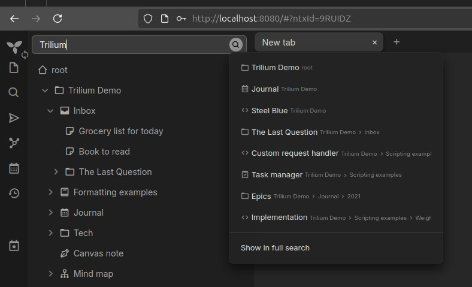

## Usage

```console
curl -H "Authorization: Bearer $TOKEN" "$SERVER_URL/search?keyword=Trilium"
```

## Example Result

Trilium Instance:



Data you will retrieve:

```json
[
  {
    "path": "root > Trilium Demo",
    "title": "Trilium Demo"
  },
  {
    "path": "root > Trilium Demo > Journal",
    "title": "Journal"
  },
  {
    "path": "root > Trilium Demo > Steel Blue",
    "title": "Steel Blue"
  },
  {
    "path": "root > Trilium Demo > Inbox > The Last Question",
    "title": "The Last Question"
  },
  {
    "path": "root > Trilium Demo > Scripting examples > Custom request handler",
    "title": "Custom request handler"
  },
  {
    "path": "root > Trilium Demo > Scripting examples > Task manager",
    "title": "Task manager"
  },
  {
    "path": "root > Trilium Demo > Journal > 2021 > Epics",
    "title": "Epics"
  },
  {
    "path": "root > Trilium Demo > Scripting examples > Weight Tracker > Implementation",
    "title": "Implementation"
  }
]
```

## Important Note

- it might take a long time on the first run because it fetches all the notes from your trilium
- `SECRET_TOKEN` variable is the same as the bearer token

## Why built this?

because i’m building a browser extension that checks if a page specific content is already archived in my trilium. if it is, it notifies me so i don’t have to check manually.

also trilium ETAPI doesn’t have a `get_all_notes` path, and `search_note` only gives `parentNoteIds`, so i added a cache to build full note paths without repeated requests.
